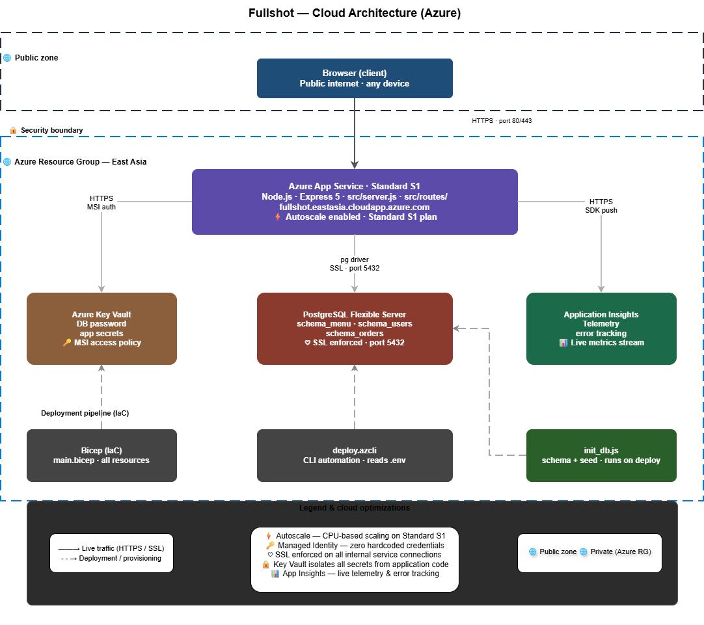

# Architecture Diagram — Fullshot Cloud Infrastructure

## Overview

This document describes the cloud architecture of **Fullshot**, a cloud-native e-commerce platform deployed on Microsoft Azure under the East Asia (Hong Kong) region. The architecture is designed around three core principles: **security**, **scalability**, and **high availability**, following the requirements of Scenario B (E-Commerce Storefront).

The diagram is available as `ArchitectureDiagram.drawio` and can be opened using [draw.io](https://app.diagrams.net/).

---

## Diagram



---

## Architecture Zones

### Public Zone
The public zone represents the open internet — any user on any device accessing the platform through a browser. All traffic from this zone enters the system exclusively via **HTTPS on ports 80/443**, ensuring that no unencrypted communication is ever accepted.

### Security Boundary
A defined security boundary separates the public internet from the internal Azure Resource Group. Only HTTPS traffic is permitted to cross this boundary, enforced at the App Service level. No direct access to the database or secrets store is exposed to the public zone.

### Azure Resource Group — East Asia
All application resources are provisioned within a single Azure Resource Group in the **East Asia (Hong Kong)** region. This logical grouping enables unified access control, cost tracking, and lifecycle management of all services.

---

## Core Services

### Azure App Service · Standard S1
The primary compute layer of the platform. The backend application runs on **Node.js with Express 5**, served through `src/server.js` and modularized API routes in `src/routes/`. The App Service is hosted at:

```
fullshot.eastasia.cloudapp.azure.com
```

**Key features:**
- Autoscale enabled — scales between 1 and 3 instances based on CPU utilization (>70% scale-out, <30% scale-in)
- Standard S1 plan — supports autoscale rules, custom domains, and SSL
- Continuous Deployment via GitHub integration through Azure Deployment Center

---

### Azure Key Vault
The Key Vault serves as the **centralized secrets manager** for the platform. It stores the PostgreSQL database password and other sensitive application secrets.

Access is controlled through a **System-Assigned Managed Identity (MSI)** — the App Service authenticates with the Key Vault at runtime using its managed identity, completely eliminating hardcoded credentials from the source code or environment variables.

**Connection:** App Service → Key Vault via HTTPS with MSI authentication.

---

### PostgreSQL Flexible Server
The managed relational database powering the platform. It hosts three core schemas:

| Schema | Purpose |
| :--- | :--- |
| `schema_menu` | Stores product catalog and menu items |
| `schema_users` | Manages user accounts, roles, and cart data |
| `schema_orders` | Tracks order records and order history |

**Key features:**
- SSL enforced on all connections (port 5432)
- Burstable B1ms tier (1 vCore, 2GB RAM) with 32GB Premium SSD
- Initialized via `db/init_db.js` using schema and seed SQL files

**Connection:** App Service → PostgreSQL via the `pg` driver over SSL.

---

### Application Insights
Provides full-stack **observability and monitoring** for the platform. Integrated with a Log Analytics Workspace, it collects real-time telemetry, tracks errors, and exposes a live metrics stream for proactive monitoring.

**Connection:** App Service → Application Insights via HTTPS SDK push.

---

## Deployment Pipeline (IaC)

The infrastructure and deployment process is fully automated through three components:

### Bicep (IaC) — `main.bicep`
Defines and provisions all Azure resources (App Service Plan, App Service, PostgreSQL Flexible Server, Key Vault, Application Insights) as code. Running the Bicep template creates the entire infrastructure from scratch in a repeatable, consistent manner.

### deploy.azcli — `deployment/deploy.azcli`
An Azure CLI automation script that reads configuration from the centralized `.env` file in the project root and executes the deployment sequence. Designed to be run from the project's root directory.

### init_db.js — `db/init_db.js`
A Node.js script that connects to the provisioned PostgreSQL instance and runs the SQL schema and seed files in the correct order:
1. `schema_menu.sql` — must run first due to foreign key dependencies
2. `schema_users.sql`
3. `schema_orders.sql`
4. `seed_data.sql`

---

## Connection Summary

| Source | Destination | Protocol | Notes |
| :--- | :--- | :--- | :--- |
| Browser | App Service | HTTPS (80/443) | All public traffic |
| App Service | Key Vault | HTTPS + MSI | Passwordless auth |
| App Service | PostgreSQL | SSL (port 5432) | via `pg` driver |
| App Service | Application Insights | HTTPS | SDK telemetry push |
| Bicep / deploy.azcli | All resources | Provisioning (dashed) | IaC deployment |
| init_db.js | PostgreSQL | SSL (port 5432) | Schema + seed on deploy |

---

## Cloud Optimizations

| Optimization | Implementation |
| :--- | :--- |
| **Scalability** | Autoscale rules on Standard S1 — CPU-based scale-out/in between 1–3 instances |
| **Security** | Managed Identity + Key Vault — zero hardcoded credentials anywhere in the codebase |
| **Encryption** | SSL enforced on all internal service connections |
| **Observability** | Application Insights + Log Analytics for live telemetry and error tracking |
| **CI/CD** | Azure Deployment Center connected to GitHub — auto-deploys on every push to `main` |

---

## Diagram File

The editable architecture diagram is located at:

```
diagram/ArchitectureDiagram.drawio
```

Open with [draw.io](https://app.diagrams.net/) (File → Import from Device) or directly via the [draw.io VS Code extension](https://marketplace.visualstudio.com/items?itemName=hediet.vscode-drawio).
